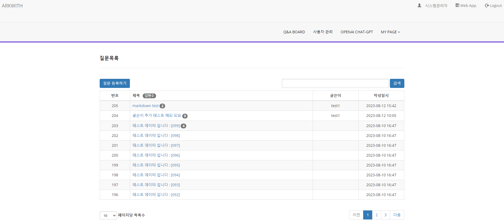

## JAVA Spring Boot Web Service Boilerplate
### Requirement
**기술스택**
- 백엔드 : 
>1. JDK : openjdk 17.0.8 2023-07-18
>2. Database : H2(Spring Boot 내장)
>3. Web F/W : 'org.springframework.boot' version '3.1.2'
>4. JPA(Java Persistence API) : ORM(Object-Relational Mapping)
>5. Spring Security

- 프런트엔드 :
>1. CSS F/W : Bootstrap v3.4.1
>2. JavaScript : jQuery v1.10.2
>3. HTML Template : Thymeleaf

- 개발도구(IDE) : VScode v1.81.1

- **참조**
>>1. [Spring | Home](https://spring.io/)
>>1. [Thymeleaf](https://www.thymeleaf.org/)
>>1. [Bootstrap 3 Tutorial](https://www.w3schools.com/bootstrap/default.asp)

### 주요기능
> **Landing Page**
>
>

> **회원가입**
>
>

> **Member Table 일반 Login,**
> **Google, Naver OAuth2 소셜 Login**
>
>

> **Admin Page**
>
>

> **사용자 프로파일**
>
>
> **Q&A BOARD 목록조회, 질문하기, 질문수정/삭제**
>
>
> **Q&A BOARD 검색**
>
>
> **Q&A BOARD Pagination**
>
>
> **Q&A BOARD 질문별 답변조회, 딥변하기, 답변수정/삭제**
>
>
> **MY PAGE - 니의가입정보**
>
>
> **MY PAGE - 비밀번호변경**
>
>
> **Admin계정 로그인시**
>> - 사용자관리 목록조회, Pagination, 사용자검색 및 등록/수정삭제 
>

### Install
#### 1. JDK 설치 : 운영체제 별로 OpenJDK17을 다운받아 설치
>> **참조**
>>
>> 1. [[Windows] 윈도우에 OpenJDK 17 설치](https://jiurinie.tistory.com/131)
>> 1. [[Mac M1] Java 17 설치](https://velog.io/@may_yun/Mac-M1-Java-17-%EC%84%A4%EC%B9%98)
>> 1. [Ubuntu JDK(JAVA Development Kit) 17 설치](https://languagestory.tistory.com/154)
>>

#### 2. 터미널 또는 VScode에서 Github Repository Clone
> ``` 
>  git clone https://github.com/arkwith7/spring-boot-starter.git
> ```
#### 3. H2 Database 설정 :
> spring.datasource.url을 jdbc:h2:~/local 로 설정했기 때문에 사용자의 홈디렉터리(~ 에 해당하는 경로) 밑에
> local.mv.db 라는 파일을 생성해야 한다. 만약 jdbc:h2:~/test라고 설정했다면 test.mv.db 라는 파일을 생성해야 한다.
>
> 사용자의 홈디렉터리는 윈도우의 경우에는 C:\Users\(사용자명) 이고 맥OS의 경우에는 /Users/(사용자명) 이다. 본인이 사용하는 OS에 맞는 홈디렉터리에 local.mv.db 파일을 생성하자. 파일은 내용 없이 빈파일로 생성한다.
>
> **- Mac OS에서 local.mv.db 파일 생성하기**
>
> ```
> pahkey@mymac ~ % touch local.mv.db
> ```
>
> ```
> pahkey@mymac ~ % chmod +x local.mv.db
> ```
>
>>**참조**
>>
>> 1. [점프 투 스프링부트 2장 스프링부트의 기본 요소 익히기! 2-03 JPA](https://wikidocs.net/161164)
>>

#### 4. 소셜로그인 설정을 위한 application-oauth.properties 생성
>```
># google 로그인 OAuth2.0 설정
>spring.security.oauth2.client.registration.google.client-id=발급받은 Client ID
>spring.security.oauth2.client.registration.google.client-secret=발급받은 Client Secret 코드
>spring.security.oauth2.client.registration.google.scope=profile,email
>
># naver 로그인 OAuth2.0 설정
># Naver
>spring.security.oauth2.client.registration.naver.client-id=발급받은 Client ID
>spring.security.oauth2.client.registration.naver.client-secret=발급받은 Client Secret 코드
>
># Naver Spring Security 수동 입력
># == http://localhost:8080/login/oauth2/code/naver
>spring.security.oauth2.client.registration.naver.redirect-uri={baseUrl}/{action}/oauth2/code/{registrationId}
>spring.security.oauth2.client.registration.naver.authorization-grant-type=authorization_code
>spring.security.oauth2.client.registration.naver.scope=name,email,nickname
>spring.security.oauth2.client.registration.naver.client-name=Naver
> 
># NAVER provider
>spring.security.oauth2.client.provider.naver.authorization-uri=https://nid.naver.com/oauth2.0/authorize
>spring.security.oauth2.client.provider.naver.token-uri=https://nid.naver.com/oauth2.0/token
>spring.security.oauth2.client.provider.naver.user-info-uri=https://openapi.naver.com/v1/nid/me
># Security의 기준이 되는 username의 이름을 네이버에서는 response로 (회원 조회시 반환되는 JSON 형태 때문)
>spring.security.oauth2.client.provider.naver.user-name-attribute=response
>
># kakao 로그인 OAuth2.0 설정
>spring.security.oauth2.client.registration.kakao.client-id=발급받은 Client ID
>spring.security.oauth2.client.registration.kakao.client-secret=발급받은 Client Secret 코드
>spring.security.oauth2.client.registration.kakao.scope=account_email,profile_nickname
>spring.security.oauth2.client.registration.kakao.authorization-grant-type=authorization_code
>spring.security.oauth2.client.registration.kakao.redirect-uri=http://localhost:8080/login/oauth2/code/kakao
>spring.security.oauth2.client.registration.kakao.client-name=Kakao
>spring.security.oauth2.client.registration.kakao.client-authentication-method=POST
>
># kakao provider
>spring.security.oauth2.client.provider.kakao.authorization-uri=https://kauth.kakao.com/oauth/authorize
>spring.security.oauth2.client.provider.kakao.token-uri=https://kauth.kakao.com/oauth/token
>spring.security.oauth2.client.provider.kakao.user-info-uri=https://kapi.kakao.com/v2/user/me
>spring.security.oauth2.client.provider.kakao.user-name-attribute=id
>
>```
>> **참조**
>
>> 1. [[Spring Boot] OAuth 2.0 로그인 (구글 로그인)](https://chb2005.tistory.com/182)
>> 2. [Spring Boot + Spring Security + OAuth2 네이버 로그인 해보기](https://velog.io/@mardi2020/Spring-Boot-Spring-Security-OAuth2-%EB%84%A4%EC%9D%B4%EB%B2%84-%EB%A1%9C%EA%B7%B8%EC%9D%B8-%ED%95%B4%EB%B3%B4%EA%B8%B0)
>>

#### 5. 실행
>**- IDE(STS 또는 intellij, VScode)**
>>```
>>src/main/java/com/arkwith/starter/StarterApplication.java 실행
>>```
>**- 터미널에서 실행(Mac, Linux는 gradlew, 윈도우는 gradlew.bat)**
>>```
>> $ ./gradlew bootRun
>>```

#### 6. 확인
>**스프링부트 스타터 웹 어플리케이션**
>> http://localhost:8080/
>>
>**부트스트랩3 UI/UX 샴플**
>> http://localhost:8080/sample/index

### 소셜 로그인, 자체로그인 통합
- 회원관리(도메인객체: src/main/java/com/arkwith/starter/user/Member.java)
- 스프링시큐리티에서 상속받아 구현 사용자 객체(src/main/java/com/arkwith/starter/auth/PrincipalDetails.java)

- 자체 로그인
>1. 로그인폼(제작: src/main/resources/templates/pages/user/login.html) -> 
>2. 스프링시큐리티 Controller(내장) -> 
>3. 스프링 시큐리티 Service(제작: src/main/java/com/arkwith/starter/auth/PrincipalDetailsService.java)  ->
>4. 회원관리 도메인 레파지터리 서비스(제작: src/main/java/com/arkwith/starter/user/UserRepository.java)
>5. 로그인 성공시 Q & A 목록 표시

- 소셜 로그인
>1. 로그인폼(제작: src/main/resources/templates/pages/user/login.html) -> 
>2. 스프링시큐리티 Controller(내장) -> 
>3. 각각의 소셜의 받아온 속성값 적재(제작: src/main/java/com/arkwith/starter/auth/OAuthAttributes.java) ->
>4. 스프링 시큐리티 Service(제작: src/main/java/com/arkwith/starter/auth/PrincipalDetailsService.java)  ->
>5. 회원관리 도메인 레파지터리 서비스(제작: src/main/java/com/arkwith/starter/auth/PrincipalOauth2UserService.java)
>6. 로그인 성공시 Q & A 목록 표시

- **참조** :
>>1. [최신 Spring Security 사용법 - SecurityFilterChain](https://samori.tistory.com/64)
>>2. [[Spring Security] 기본 구조 및 구현 방법 간단 요약](https://to-moneyking.tistory.com/78)
>>3. [Spring Security의 구조(Architecture) 및 처리 과정 알아보기](https://dev-coco.tistory.com/174)
>>3. [Spring Boot 게시판 OAuth 2.0 구글 로그인 구현](https://dev-coco.tistory.com/128)